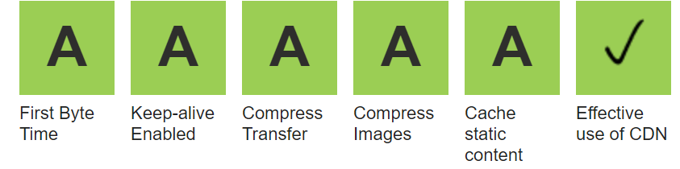
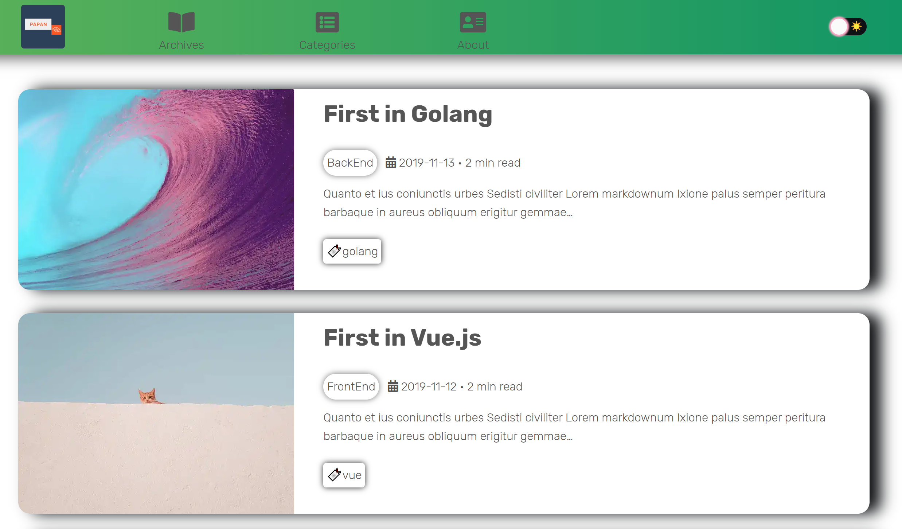
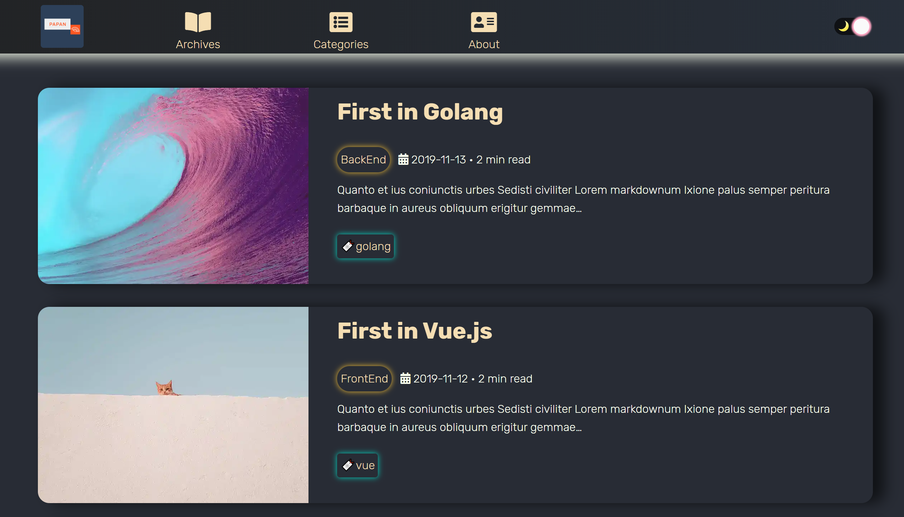

<!-- AUTO-GENERATED-CONTENT:START (STARTER) -->
<p align="center">
  <a href="https://papan01-gatsby-starter.netlify.com/">
    
  </a>
</p>

<div align="center">
  <a href="https://github.com/papan01/papan01-gatsby-starter/blob/master/LICENSE">
    
  </a>
  <a href="https://papan01-gatsby-starter.netlify.com/">
    
  </a>
  <a href="https://www.codacy.com/manual/papan01/papan01-gatsby-starter?utm_source=github.com&amp;utm_medium=referral&amp;utm_content=papan01/papan01-gatsby-starter&amp;utm_campaign=Badge_Grade">
    
  </a>
</div>                   

<h1 align="center">
  Papan01 Gatsby Starter
</h1>

A Gatsby blog starter. The theme is controlled yourself. 

See the starter in action » [Demo WebSite](https://papan01-blog-gatsby-starter.netlify.com/)

## 🎏 Audit Score

- Lighthouse

<div align="center">
  <a href="http://developers.google.com/web/tools/lighthouse/">
    
  </a>
</div>

- Webpagetest

<div align="center">
  <a href="https://webpagetest.org">
    
  </a>
</div>

## ⛩ Features
- React Hooks
- SSR React Code Splitting([loadable-components](https://github.com/gregberge/loadable-components))
- Theme Toggle(light/dark)

Light                  | Dark
:---------------------:|:---------------------:
    |
- Pagination
- SEO(Sitemap, Schema.org, OpenGraph tags, Twitter tag)
- Web application manifest and offline support 
- Google analytics
- Tags
- Categories
- Posts in Markdown
- Disqus comments
- RSS feeds
- Development tools
  - ESLint(Airbnb) for linting
  - Prettier code formatting
  - gh-pages for deploying to GitHub pages

## 🚀 Getting Start

1. **Create a Gatsby site.**

Use the [Gatsby CLI](https://www.gatsbyjs.org/docs/gatsby-cli/) to create a new site.

```sh
gatsby new YOUR-PROJECT-NAME https://github.com/papan01/papan01-gatsby-starter
```

1.  **Start developing.**

Navigate into your new site’s directory and start it up.

```sh
cd YOUR-PROJECT-NAME
npm run develop
```

1.  **Open the source code and start editing!**

Your site is now running at `http://localhost:8000`!

_Note: You'll also see a second link: _`http://localhost:8000/___graphql`_. This is a tool you can use to experiment with querying your data. Learn more about using thitool in the [Gatsby tutorial](https://www.gatsbyjs.org/tutorial/part-five/#introducing-graphiql)._

Or 

```sh
git clone https://github.com/papan01/papan01-gatsby-starter.git YOUR-PROJECT-NAME
cd YOUR-PROJECT-NAME
rm -rf .git
npm install
npm run develop
```

## ⚙️ Configuration

Edit the confing in config/siteConfig.js:

```js
const config = {
  author: 'Papan01', // Site owner
  siteTitle: 'Papan01-Blog-Gatsby-Starter', // Site title.
  siteTitleShort: 'P01 GatsbyJS', // Short site title for homescreen (PWA). Preferably should be under 12 characters to prevent truncation.
  siteTitleAlt: 'Papan01-Blog-GatsbyJS-Starter', // Alternative site title for SEO.
  siteLanguage: 'en', // Site language.
  siteDescription: 'A blog starter with the bare essentials needed for a Gatsby site(SEO, pagination, category etc.)', // Website description used for RSS feeds/meta description tag.
  siteLogo: 'static/favicons/favicon.png', // Logo used for manifest.
  siteUrl: 'https://papan01-blog-gatsby-starter.netlify.com', // Domain of your website without pathPrefix.
  pathPrefix: '/', // Prefixes all links. For cases when deployed to example.github.io/gatsby-material-starter/.
  siteRss: '/rss.xml', // Path to the RSS file.
  siteFBAppID: '464217807633356', // FB Application ID for using app insights
  siteGATrackingID: 'UA-153303709-3', // Tracking code ID for google analytics.
  disqusShortname: 'papan01-blog-gatsbyjs-starter', // Disqus shortname.
  twitterUserName: '', // twitter creator for SEO
  datePublished: '2019-12-08', // for SEO
  copyrightYear: '2019', // for SEO
  postsPerPage: 4, // posts per page used in gatsby-node.js
  // Links to social profiles you want to display in the footer.
  rrssb: [
    {
      label: 'github',
      url: 'https://github.com/papan01',
      iconClassName: 'fab fa-github',
    },
    {
      label: 'mail',
      url: 'mailto: navy90517@gmail.com',
      iconClassName: 'fa fa-envelope',
    },
    {
      label: 'facebbok',
      url: 'https://www.facebook.com/louis.peng.58?ref=bookmarks',
      iconClassName: 'fab fa-facebook',
    },
    {
      label: 'instagram',
      url: 'https://www.instagram.com/n_louis_peng/?hl=zh-tw',
      iconClassName: 'fab fa-instagram',
    },
  ],
  // Links to pages you want to display in the navigation bar.
  navbarLinks: [
    {
      label: 'Archives',
      url: '/archives',
      iconClassName: 'fa fa-book-open',
    },
    {
      label: 'Categories',
      url: '/categories',
      iconClassName: 'fa fa-list-alt',
    },
    {
      label: 'About',
      url: '/about',
      iconClassName: 'fa fa-address-card',
    },
  ],
};
config.copyright = `Copyright © ${config.copyrightYear}. ${config.author}`;
```


